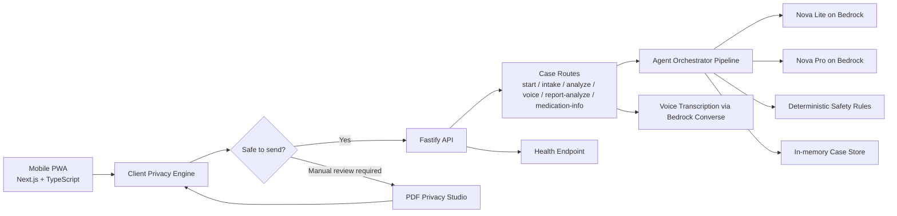
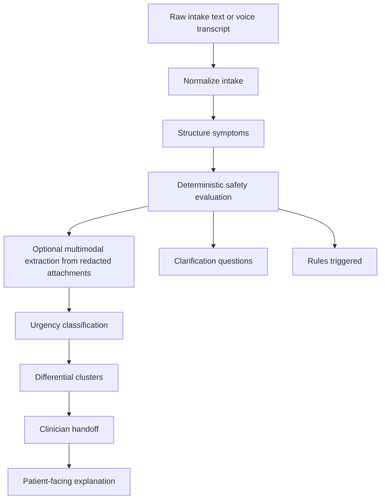

# NovaTriage

<p align="center">
  
</p>

<p align="center">
  <strong>Privacy-first, mobile-first AI triage copilot built on Amazon Nova through AWS Bedrock.</strong>
</p>

<p align="center">
  NovaTriage helps caregivers, EMS teams, and intake staff turn fragmented symptoms, voice notes, PDFs, and images into a structured, safety-aware clinical handoff in seconds.
</p>

## Inspiration

Triage is one of the most time-critical moments in healthcare, yet it often starts with noisy, incomplete, and unstructured information. Caregivers and intake staff must quickly interpret symptoms, demographics, protocol context, and sometimes low-quality documents or device readings, all while protecting patient privacy.

NovaTriage was built from a simple premise: AI should accelerate understanding, not replace medical judgment. We wanted to show that multimodal Amazon Nova models can support real-world clinical intake workflows while keeping privacy at the edge and adding deterministic safety guardrails before any high-stakes recommendation is shown.

The result is a system designed for a realistic contest scenario: a mobile-first healthcare copilot that feels operational, uses Amazon Nova models in distinct specialized roles, and demonstrates how agentic orchestration plus privacy-by-design can improve triage quality under pressure.

## What NovaTriage Does

NovaTriage is a mobile-first Progressive Web App that supports three operational flows:

- `AI triage`: symptom intake, urgency estimation, red flag detection, clinician handoff, and patient-friendly next steps
- `Report review`: structured analysis of clinical reports and attachments
- `Medication guidance`: general medication overview with guardrails, contraindications, and dosing context

Users can:

- describe symptoms via `text` or `voice`
- attach `documents`, `images`, and `PDFs`
- run `client-side privacy redaction` before backend analysis
- review `red flags`, `urgency`, `possible clinical clusters`, and `confidence`
- generate a concise `clinician-ready handoff summary`
- inspect and sanitize difficult PDFs in a dedicated `PDF Privacy Studio`

This is not a diagnosis engine. NovaTriage is built to help a clinician or caregiver understand the case faster and hand it off more safely.

## Built for the Amazon Nova Hackathon

NovaTriage is intentionally structured around Amazon Nova model specialization rather than a single generic prompt.

Implemented model usage in this repo:

- `Amazon Nova Lite`
  - intake normalization
  - symptom structuring
  - urgency classification
  - patient explanation
- `Amazon Nova Pro`
  - multimodal attachment extraction
  - differential cluster generation
  - clinician handoff composition
  - report analysis
  - medication guidance
- `Amazon Nova voice-capable endpoint via Bedrock Converse`
  - voice transcription in the intake flow
  - configurable through `BEDROCK_NOVA_SONIC_MODEL`
  - current default in code maps to `us.amazon.nova-micro-v1:0`

This gives the project a clear AWS story:

- `AWS Bedrock` for model inference
- `Amazon Nova` for multimodal and agentic reasoning
- `Docker Compose` for local full-stack execution
- `Helm charts` in [`infra/helm/novatriage`](./infra/helm/novatriage) for cloud deployment scaffolding

## Why the Agentic Design Matters

The orchestration logic is not a single black-box call. It is a coordinated pipeline of specialist stages inspired by the multi-agent approach described in [`eval/MULTI.md`](./eval/MULTI.md), then adapted to what is actually implemented in the codebase today.

Current coordinated stages:

1. `Intake Normalizer Agent` with Nova Lite
   - cleans raw symptom text
   - removes filler and ASR noise
   - infers likely language
2. `Symptom Structurer Agent` with Nova Lite
   - converts narrative intake into structured clinical JSON
3. `Deterministic Safety Layer`
   - applies hard clinical-style safety rules
   - forces escalation when required
   - produces `rules_triggered`, `clarification_questions`, and `missing_information`
4. `Multimodal Extractor Agent` with Nova Pro
   - processes redacted attachments
   - extracts clinically relevant findings from documents and images
5. `Risk Classifier Agent` with Nova Lite
   - estimates urgency
   - surfaces risk factors and reasoning summary
6. `Differential Clusters Agent` with Nova Pro
   - proposes likely clinical clusters with confidence and supporting/against factors
7. `Clinician Handoff Composer` with Nova Pro
   - creates a compact markdown handoff summary
8. `Patient Explanation Agent` with Nova Lite
   - translates the outcome into understandable next steps

This split is useful both technically and narratively:

- it reduces prompt sprawl
- it makes reasoning easier to test
- it keeps expensive multimodal reasoning where it is actually needed
- it provides a much stronger hackathon story around purposeful Amazon Nova orchestration

## Privacy-First by Design

NovaTriage puts privacy before inference.

Implemented today:

- `client-side PII redaction` for text before analysis
- `client-side document inspection` for text files, images, and PDFs
- `PDF Privacy Studio` for local PDF analysis and sanitization
- `manual review gates` when sanitization confidence is not good enough
- `image-only PDF output` for non-text-native cases, removing the text layer from the final document

Important nuance:

- client-side privacy is implemented and operational
- a full AWS-side privacy zone with `S3/Textract/redaction-before-Bedrock` is **not** currently part of the implemented runtime
- durable anonymized case storage in `DynamoDB` is **not** currently implemented in the backend

That distinction matters for accuracy. The current demo is strong on edge privacy and Bedrock usage; an AWS privacy zone would be a future extension, not something hidden behind marketing language.

## High-Level Architecture



## Agentic Flow at Runtime



## What Is Actually Implemented

The repo currently includes:

- mobile-first `Next.js` PWA frontend
- `Fastify` backend API
- `AWS Bedrock` integration via `@aws-sdk/client-bedrock-runtime`
- Nova-powered triage pipeline in [`apps/triage-api/src/services/agent-orchestrator/pipeline.ts`](./apps/triage-api/src/services/agent-orchestrator/pipeline.ts)
- safety rules in [`apps/triage-api/src/services/agent-orchestrator/safety.ts`](./apps/triage-api/src/services/agent-orchestrator/safety.ts)
- triage routes, report analysis, medication guidance, and voice transcription in [`apps/triage-api/src/routes/case.ts`](./apps/triage-api/src/routes/case.ts)
- client-side privacy engine and PDF anonymizer in:
  - [`apps/frontend-pwa/src/lib/privacy-engine.ts`](./apps/frontend-pwa/src/lib/privacy-engine.ts)
  - [`apps/frontend-pwa/src/lib/pdf-anonymizer.ts`](./apps/frontend-pwa/src/lib/pdf-anonymizer.ts)
- demo flows for:
  - home-care triage
  - report review
  - medication guidance
- result UI with:
  - `rules_triggered`
  - `safety_escalation_applied`
  - `clarification_questions`
  - `audit_trail`

## Current AWS Scope

Implemented now:

- `AWS Bedrock` configuration and health visibility
- `Amazon Nova` inference for text and multimodal reasoning
- configurable model IDs through environment variables
- deployment scaffold through `Helm`

Not yet implemented in the runtime:

- `S3` storage for redacted artifacts
- `DynamoDB` case persistence
- end-to-end AWS privacy fallback pipeline

These are valid next steps, but they are not claimed as done here.

## Repository Structure

```text
apps/
  frontend-pwa/    Next.js PWA frontend
  triage-api/      Fastify API and Bedrock integration
packages/
  prompts/         Prompt templates for specialist agents
  shared-types/    Shared DTOs and response contracts
infra/
  helm/novatriage/ Deployment scaffold for Kubernetes/Helm
eval/
  MULTI.md         Agent orchestration positioning notes
```

## Tech Stack

### Frontend

- `Next.js`
- `React`
- `TypeScript`
- `Tailwind CSS`
- `PWA architecture`

### Backend

- `Node.js`
- `Fastify`
- `Zod`
- `AWS SDK for Bedrock Runtime`

### Local Privacy Processing

- `pdf.js runtime`
- `pdf-lib`
- `tesseract.js`

## Local Development

### Prerequisites

You need AWS credentials with Bedrock access to the configured Amazon Nova models.

Required environment:

- `AWS_REGION`
- one of:
  - `AWS_ACCESS_KEY_ID` and `AWS_SECRET_ACCESS_KEY`
  - `AWS_PROFILE`
  - container/task credentials

Optional model overrides:

- `BEDROCK_NOVA_LITE_MODEL`
- `BEDROCK_NOVA_PRO_MODEL`
- `BEDROCK_NOVA_SONIC_MODEL`

### Install

```bash
npm install
```

### Run the frontend and API separately

```bash
npm run dev -w triage-api
npm run dev -w frontend-pwa
```

Frontend:

- `http://localhost:3000`

API:

- `http://localhost:8080`
- health: `http://localhost:8080/api/health`

### Run with Docker

```bash
docker compose up --build
```

## Verification

```bash
npm run test -w triage-api
npm run test -w frontend-pwa
npm run build -w triage-api
npm run build -w frontend-pwa
docker compose config
```

## Demo Narrative for Judges

The strongest contest framing is:

- privacy happens first, on device
- Amazon Nova models are used in specialized roles, not as one generic answer engine
- deterministic safety logic can override model reasoning
- the output is optimized for operational handoff, not speculative diagnosis
- the system works across voice, free text, documents, and reports

That combination is what makes NovaTriage feel practical rather than experimental.

## Challenges We Solved

- `Clinical safety vs AI flexibility`
  - solved with deterministic escalation rules layered into the orchestration pipeline
- `Privacy vs usefulness`
  - solved with client-side redaction and manual review gates
- `Multimodal intake reliability`
  - solved with a staged architecture and attachment-aware processing
- `Hackathon realism`
  - solved by building a working PWA + API stack instead of a prompt-only prototype

## What We Are Proud Of

- a working privacy-first intake experience, not just a backend demo
- meaningful Amazon Nova specialization across the flow
- a clinician-facing handoff that is actually readable and compact
- visible safety traceability through rules, escalation badges, and audit trail
- a dedicated local PDF privacy workflow integrated into the rest of the product

## What We Learned

- agentic decomposition is especially useful in regulated or safety-sensitive workflows
- multimodal AI is much more useful when paired with structured intermediate outputs
- privacy features become materially stronger when they are part of UX, not just compliance text
- for healthcare-adjacent use cases, model quality is not enough without explicit operational guardrails

## What’s Next

Near-term extensions that make sense:

- stronger patient-name detection and safer PHI extraction defaults
- broader multilingual support across the full UX and prompts
- improved document OCR and review tooling for harder scans
- durable case persistence
- AWS-side privacy zone with services such as `S3`, `Textract`, and redaction workflows before Bedrock
- clinician dashboard and analytics layer

Longer-term, NovaTriage could evolve into a privacy-first intake platform for hospitals, EMS services, home-care teams, and remote monitoring workflows built directly on Amazon Nova and AWS.
